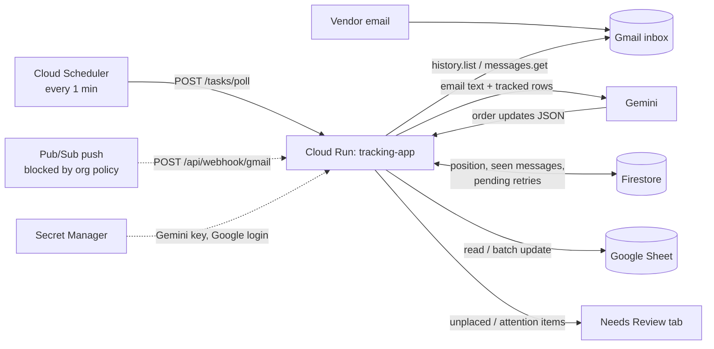

# Design: Vendor Order Tracking Automation

**Implements:** [requirements.md](requirements.md) · **Plan:** [tasks.md](tasks.md)

## 1. Overview

A small FastAPI service that reads new Gmail messages, asks Gemini to turn each into structured
"order updates", matches each update to sheet rows by Order No / SKU using deterministic code, and
applies a conservative update policy. It runs on Cloud Run, triggered by Cloud Scheduler.

Guiding principle: **the model proposes, the code disposes.** Gemini only interprets text. Every
decision that touches the sheet (which row, what may change, what may never change) is plain,
unit-tested code.

## 2. Architecture

### Request flow (one poll)

1. Scheduler calls `/tasks/poll` (authenticated with a service-account identity token).
2. `pipeline._run` loads the stored Gmail `historyId`; if none, records the current one and stops (first run).
3. `history.list` returns message IDs added to INBOX since that position.
4. For each never-seen message (plus failures whose backoff elapsed): fetch, parse, send to Gemini with the sheet's **tracked rows**.
5. For each returned update: `matching.match_update` → `sheets.plan_update` → `SheetClient.apply` (unless dry-run).
6. Unplaced updates → Needs Review tab + a pending record; attention events (delay/backorder/cancel) → Needs Review too.
7. Store the new `historyId`; retry pending updates at most once a minute.

The whole poll runs **inside the request**. Cloud Run throttles CPU after a response, so no background work is used.

## 3. Components

| File | Responsibility |
|---|---|
| `main.py` | FastAPI app. `/health`, `/api/webhook/gmail`, `/tasks/poll`, `/tasks/renew-watch`; local poll loop when `INGEST_MODE=poll`. |
| `pipeline.py` | Orchestration, locking, retries, quota handling, pending retry, `reprocess`, `ensure_watch`. |
| `gmail_client.py` | OAuth credentials (secret or file), watch, history polling, message parsing (plain/HTML bodies, attachments names). |
| `extractor.py` | Gemini call: prompt, JSON-schema response, validation. |
| `models.py` | Pydantic schema: `OrderUpdate`, `LineItem`, `ExtractionResult`. |
| `matching.py` | Pure: which rows an update belongs to. |
| `sheets.py` | Pure: table location, aliases, `plan_update`; IO: `SheetClient`, `ReviewTab`, `LogTab`. |
| `state.py` | SQLite (local) and Firestore (cloud) state with one interface. |
| `config.py` | Environment-driven settings. |
| `auth.py`, `check_setup.py`, `reprocess.py` | One-time sign-in, preflight, backfill/test tool. |
| `Dockerfile`, `DEPLOY.md` | Packaging and deployment commands. |

## 4. Data model

**Extraction schema (Gemini output).** `ExtractionResult { is_order_related, updates[] }`;
`OrderUpdate { order_number, vendor, event, event_date, est_arrival, lead_time, tracking_number, carrier, lines[], matched_rows[], notes }`;
`event ∈ {order_confirmed, in_production, shipped, delivered, delayed, backordered, cancelled, other}`.

**Prompt inputs.** Email (date, sender, subject, attachment names, body ≤ 12,000 chars) and **tracked rows**
(only rows with an Order No or SKU, ≤ 400): `row | order | sku | room | item | status`.

**Sheet columns used** (by header, any order): Room, Item, Order No, Item SKU, Status, Ordered, Shipped,
Received, Estimate Arrival, Lead Time, Notes, optional Tracking. Aliases cover variants ("Order #", "ETA", ...).

**State** (same interface, two backends)

| Collection / table | Key | Contents |
|---|---|---|
| `kv` | name | `history_id`, `pending_checked` |
| `messages` | Gmail message ID | status (`done`, `skipped`, `dry_run`, `failed`, `deferred`), attempts, detail, updated_at |
| `pending` | `<messageId>:<updateIndex>` | JSON of the email identity and the update; expires after 3 days |

## 5. Matching algorithm (`matching.match_update`)

1. Normalise ids: lowercase, strip everything except letters and digits (`SO-4412` = `so 4412` = `#SO4412`). A cell may contain several ids (`A100, B200`).
2. Candidate rows: rows whose Order No contains the email's order number. If none, rows whose SKU matches **and** whose Order No is blank. A SKU found only under a *different* order number is rejected.
3. If the email's SKUs hit some candidate rows, narrow to those.
4. If one row remains, done. If several:
   - no items named → whole order (order-number matches only);
   - items named by SKU → those rows;
   - items named by name only → intersect with the model's `matched_rows`; empty ⇒ unplaced.
5. No candidates ⇒ unplaced with a human-readable reason ("order number X is not on the sheet yet", ...).

The model cannot introduce a row that steps 2 to 4 did not already allow.

## 6. Update policy (`sheets.plan_update`)

| Field | Rule |
|---|---|
| Status | Forward only along the dropdown order. Hold/unknown values untouched. Delay/backorder/cancel do not change it. |
| Ordered / Shipped / Received | Event date (or email date), only if blank. |
| Estimate Arrival | Overwrite if different (dates compared as dates, so `11/3` equals `2026-11-03`); never on delivery. |
| Lead Time | Overwrite if different. |
| Tracking | Set if blank, else in Notes; no column ⇒ Notes. |
| Order No | Fill if blank and the row was matched by SKU. |
| Notes | Append `[m/d] Vendor: Event | order N | carrier tracking | detail`; skipped if already present. |
| Never touched | Qty, Priority, budgets, Quoted/Actual, Owner, Flag, Approved, Client Review, links. |

All values are written with `USER_ENTERED` so dates become real dates; strings that start with `= + - @`
are prefixed with `'` to neutralise formulas. Re-applying the same update yields a `noop` plan.

## 7. Failure handling

| Failure | Behavior |
|---|---|
| Gemini 503/transient | Message marked `failed`; retried after 60 s × attempts, up to 6 times (~15 min). |
| Gemini 429 quota | Current + remaining messages marked `deferred`; run stops; retried every 5 min, never exhausted. |
| Gmail history expired | Falls back to last day of inbox mail (≤ 50). |
| Unmatched update | Needs Review row + pending retry for 3 days. |
| Pipeline exception in a webhook/task | HTTP 500, so Pub/Sub or Scheduler redeliver. |
| Two overlapping runs | Process-wide lock; Cloud Run `max-instances=1`. |
| Duplicate email | Message-ID dedupe plus idempotent plans. |

## 8. Deployment

| Resource | Value |
|---|---|
| Project | `YOUR_PROJECT_ID` (same project as the OAuth client, required by Gmail push) |
| Service | Cloud Run `tracking-app`, `us-west1`, private (`--no-allow-unauthenticated`), max 1 instance, 512 MiB, 300 s timeout |
| State | Firestore (native, `us-west1`) |
| Secrets | Secret Manager: `gemini-api-key`, `google-token` → env `GEMINI_API_KEY`, `GOOGLE_TOKEN_JSON` |
| Trigger | Cloud Scheduler `backup-poll` (`* * * * *`); `renew-gmail-watch` (daily 04:00 UTC, **paused**) |
| Push path (built, inactive) | Pub/Sub topic `gmail-push` → push subscription `gmail-push-sub` (OIDC) → `/api/webhook/gmail` |
| Identities | `tracking-runtime` (Firestore, secrets); `tracking-invoker` (calls the service, mints Pub/Sub tokens) |
| Cost control | Budget alert $5/month; everything else in free tiers |

Local mode (`INGEST_MODE=poll`, `STATE_BACKEND=sqlite`) uses the same pipeline with an in-process 15-second loop.
`DRY_RUN` defaults to true everywhere except where explicitly turned off.

## 9. Security

- Cloud Run is private: unauthenticated calls return 403; only the invoker identity may call it.
- No secrets in the image (`.dockerignore`) or repository (`.gitignore`); `credentials.json`/`token.json` are local, mode 600.
- Email content is untrusted: the prompt instructs the model to extract only; the sheet policy is code-enforced, so injected text cannot widen what gets written. Formula injection is neutralised.
- The Google login requests only Gmail read-only and Sheets scopes. The sheet is opened by ID because name lookup would need Drive access.

## 10. Design decisions

| ID | Decision | Why / trade-off |
|---|---|---|
| D1 | **Post-order tracking keyed on Order No / SKU**, not fuzzy room/item names | Vendor emails almost always contain an order number; exact keys remove the main source of wrong matches. Cost: a person records the keys when ordering. |
| D2 | **LLM proposes, code disposes** | Auditable, testable safety rules; the model can't touch protected columns or unrelated rows. |
| D3 | **Never create rows** | A new row falls below the TOTAL row and outside its SUM; unplaced items go to a review tab instead. |
| D4 | **Cloud Run + Scheduler + Firestore** over a laptop + ngrok | Laptop-off operation within free tiers. ngrok would still need the laptop running. |
| D5 | **1-minute scheduled poll now; Pub/Sub push later** | Push is blocked by an org policy that only an organization admin can relax. Polling is simple and free; 15 s polling would need a Cloud Tasks chain or paid always-on time. |
| D6 | **Work inside the request**, no background tasks | Cloud Run throttles CPU after the response is sent. |
| D7 | **Gemini** (JSON-schema output) | Chosen by the owner; paid tier required (free tier is 20 requests/day and may use content for training). |
| D8 | **No website crawler** | 55% of linked product pages block automated fetches; an automated browser was blocked outright; defeating bot protection is out of bounds. Arhaus pages were crawlable but only for price/stock. |
| D9 | **Sheet by ID, columns by header** | Survives column moves and renames of the file; name lookup needs extra permissions. |
| D10 | **Dry-run first** | Lets the owner see exact intended values before any write. |

## 11. Testing

- **Unit tests (37):** matching (order/SKU/names/ambiguity), update policy (status order, dates, idempotency, formula neutralisation, date comparison), message parsing, state backoff/deferral/pending.
- **Live checks:** `check_setup.py` (Gmail, sheet, Gemini); `reprocess.py` with dry-run against real mail; cloud dry-run then live on real emails.
- **Not covered:** Firestore backend has no automated test (verified only through live use); no end-to-end test of Pub/Sub push; extraction quality is checked by hand, not by an evaluation set.

## 12. Known limits and risks

- Attachments are not read; confirmations delivered only as PDFs are unplaced.
- Only the email's own thread of information is used; earlier messages in the thread are not provided to the model.
- Extraction quality depends on Gemini; model availability can spike (503) or hit quota.
- Latency is up to a minute plus processing until push is enabled.
- The Google login depends on the consent screen being In production.
